# VoltStream
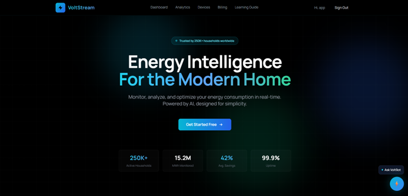

VoltStream is an AI-powered smart energy management platform developed to monitor electricity usage, manage smart devices, and provide intelligent analytical insights through an interactive web application. The project integrates conversational AI and Retrieval-Augmented Generation (RAG) to deliver context-aware responses using uploaded PDF documents. Built using React.js and FastAPI, the platform combines scalable backend services with a modern frontend architecture for seamless user experience. Technologies such as Google Gemini API, ChromaDB, Sentence Transformers, and MongoDB are used to implement semantic search, vector embeddings, and AI-driven interactions. The system also includes secure JWT-based authentication, dashboard analytics, billing management, and device monitoring functionalities. VoltStream demonstrates the practical implementation of full-stack development, AI integration, semantic retrieval systems, and modern cloud-ready architecture within a unified intelligent  platform.

## Complete End-to-End Architecture
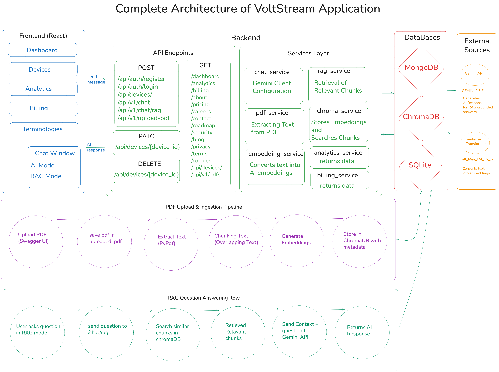

## File Structure
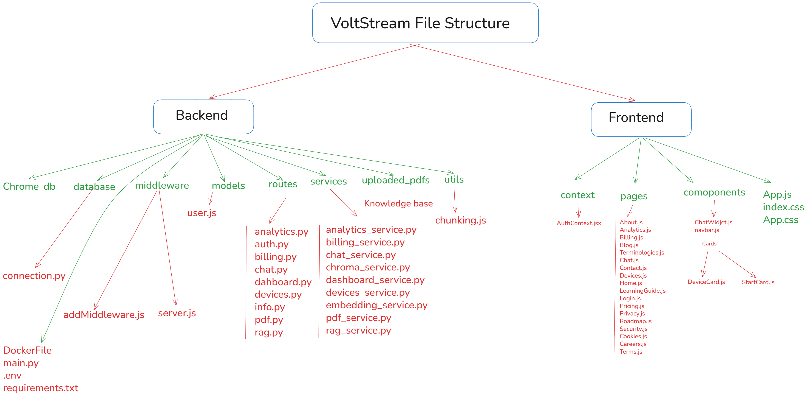


## Agent Architecture Workflow
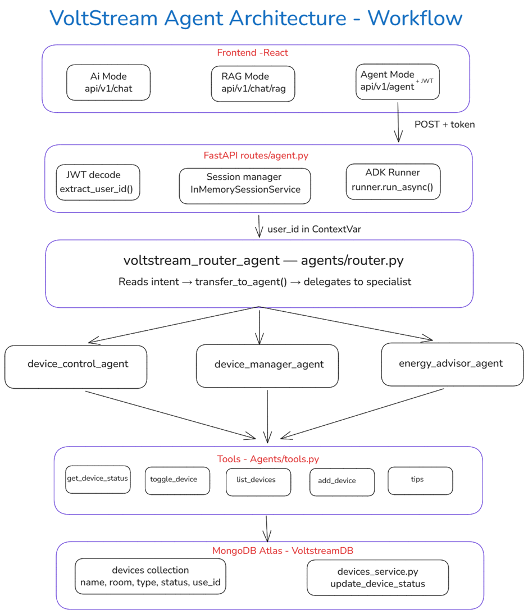  

# VOLTSTREAM (Week 3)
## Intelligent Energy Management Platform

---


# Table of Contents

1. Introduction  
2. Project Overview  
3. Problem Statement  
4. Objectives of the Project  
5. Proposed Solution  
6. Complete Architecture  
7. Conversational AI and RAG Workflow  
8. Authentication System  
9. API Endpoints  
10. File Structure Explanation  
11. Technologies, Tools, and Libraries Used  
12. Conclusion  
13. Future Enhancements  
14. Platform Output Images  

---

# 1. Introduction

VoltStream is an AI-powered smart energy management platform developed to monitor electricity usage, provide analytical insights, manage smart devices, and assist users through conversational artificial intelligence.

The application combines modern frontend technologies with scalable backend architecture and integrates Retrieval-Augmented Generation (RAG) for context-aware AI responses.

The project was developed using React.js for frontend development and FastAPI for backend API services. The application also integrates Google Gemini API, Sentence Transformers, ChromaDB, MongoDB, and semantic search systems.

VoltStream provides users with:

- Smart energy monitoring  
- Device management  
- Billing insights  
- AI-powered chatbot assistance  
- PDF-based contextual question answering  
- Energy optimization guidance  

The project follows a modular architecture where frontend, backend, databases, AI services, and authentication systems work together as a unified intelligent platform.

---

# 2. Project Overview

VoltStream is designed as a full-stack intelligent web application capable of handling both traditional application workflows and AI-driven workflows.

The project contains two primary systems:

1. Smart Energy Monitoring System  
2. AI-Powered Conversational Assistant System  

The frontend provides a user-friendly dashboard where users can:

- Monitor devices  
- Analyze energy consumption  
- View billing insights  
- Access learning resources  
- Interact with VoltBot AI assistant  

The backend provides REST APIs for:

- Authentication  
- Dashboard analytics  
- Device management  
- Billing services  
- Conversational AI  
- RAG workflows  
- PDF processing  

The application also contains a dual-mode chatbot system:

- Normal Conversational AI Mode  
- Retrieval-Augmented Generation (RAG) Mode  

The normal AI mode uses Gemini directly for general conversations, while the RAG mode retrieves information from uploaded PDF documents using semantic similarity search before generating the final response.

---

# 3. Problem Statement

Traditional energy monitoring systems generally provide only static dashboards and limited analytical functionality. Most existing systems do not provide intelligent interaction, contextual assistance, or AI-powered recommendations.

Users often face difficulties such as:

- Understanding energy analytics  
- Monitoring electricity usage efficiently  
- Accessing contextual technical information  
- Managing multiple smart devices  
- Receiving intelligent recommendations  
- Understanding billing breakdowns  

Most traditional systems also lack conversational interfaces and document-aware AI assistance.

VoltStream addresses these limitations by integrating conversational AI, semantic retrieval systems, vector databases, and Retrieval-Augmented Generation into a single smart energy platform.

---

# 4. Objectives of the Project

The primary objective of VoltStream is to create an intelligent energy management platform capable of combining smart analytics with conversational AI assistance.

## Objectives

1. Developing a modern energy monitoring platform  
2. Implementing AI-powered conversational assistance  
3. Building a Retrieval-Augmented Generation pipeline  
4. Integrating semantic search workflows  
5. Implementing JWT-based authentication  
6. Creating scalable backend APIs  
7. Integrating vector database architecture  
8. Supporting PDF-based contextual retrieval  
9. Building modular frontend and backend systems  
10. Designing cloud-ready deployment architecture  

The project also aims to provide practical implementation experience in AI engineering concepts such as embeddings, vector databases, semantic search, prompt engineering, and RAG systems.

---

# 5. Proposed Solution

VoltStream solves the identified challenges by combining:

- Real-time dashboard interfaces  
- AI-powered chatbot systems  
- Retrieval-Augmented Generation  
- Smart energy analytics  
- Secure authentication systems  
- Semantic search architecture  
- Vector database integration  
- Modular API-based backend architecture  

The platform enables users to communicate naturally with the system and receive intelligent responses grounded in uploaded knowledge-base documents.

The integration of Gemini API, ChromaDB, Sentence Transformers, and FastAPI allows VoltStream to function as both an operational energy management system and an AI-powered assistant platform.

---

# 6. Complete Architecture

## Complete System Architecture


The VoltStream architecture follows a modular full-stack design consisting of:

- Frontend Layer  
- Backend Layer  
- AI Processing Layer  
- Database Layer  
- Vector Database Layer  
- Authentication Layer  

The frontend communicates with backend APIs using HTTP requests. The backend processes requests, manages business logic, communicates with databases, and integrates AI services for conversational and RAG-based responses.

The system also contains a dedicated PDF ingestion and semantic retrieval pipeline for document-aware question answering.

The architecture image included in the documentation visually represents:

- Frontend workflow  
- Backend API structure  
- Service layer  
- Database communication  
- ChromaDB integration  
- Gemini API integration  
- PDF ingestion workflow  
- RAG question answering workflow  

---

## Frontend Architecture

The frontend of VoltStream is developed using React.js and Tailwind CSS.

The frontend layer is responsible for:

- Rendering user interfaces  
- Managing application routing  
- Handling authentication state  
- Sending API requests  
- Displaying chatbot responses  
- Managing user interactions  

The frontend follows a component-based architecture where reusable components are organized into dedicated folders.

### Main Frontend Components

#### App.js
Acts as the root component of the application. Handles routing, authentication provider integration, and global layout rendering.

#### ChatWidget.js
Implements the floating chatbot interface. Handles AI mode switching, message sending, API communication, and response rendering.

#### Navbar.js
Provides navigation functionality across application pages.

#### AuthContext.jsx
Manages global authentication state using React Context API.

### Pages Folder

Contains all frontend pages such as:

- Dashboard  
- Analytics  
- Billing  
- Devices  
- Chat  
- Login  
- About  
- Privacy  
- Terms  
- Roadmap  

The frontend also uses React Router for protected and public routes.

---

## Backend Architecture

The backend of VoltStream is developed using FastAPI and follows a layered modular architecture.

The backend consists of:

- Routes Layer  
- Service Layer  
- Database Layer  
- Utility Layer  
- AI Integration Layer  

### Backend Responsibilities

- API endpoint handling  
- Authentication and authorization  
- Device management  
- Dashboard analytics  
- Billing calculations  
- AI response generation  
- PDF processing  
- Embedding generation  
- Semantic retrieval  
- ChromaDB integration  

The backend architecture separates route handling from business logic for scalability and maintainability.

### Backend Workflow

1. Frontend sends API request  
2. FastAPI route receives request  
3. Route validates input  
4. Service layer processes business logic  
5. Database or AI services execute required tasks  
6. Final response returned to frontend  

---

# 7. Conversational AI and RAG Workflow

VoltStream contains a conversational AI assistant called **VoltBot**.

The chatbot operates in two modes:

1. General Conversational AI Mode  
2. Retrieval-Augmented Generation (RAG) Mode  

The frontend contains a single chatbot widget with a toggle switch that dynamically changes the backend processing pipeline.

---

## General Conversational AI Workflow

### Step 1
User enters message inside ChatWidget.

### Step 2
Frontend sends request to:

```bash
/api/v1/chat
```

### Step 3
`routes/chat.py` receives the request.

### Step 4
`chat_service.py` forwards prompt to Gemini API.

### Step 5
Gemini generates conversational response.

### Step 6
Backend sends response back to frontend.

### Step 7
ChatWidget displays final AI response.

The chatbot behavior is controlled using a detailed system prompt that defines:

- Tone  
- Personality  
- Professional behavior  
- Response length  
- Energy-related expertise  

---

## Retrieval-Augmented Generation (RAG) Workflow

The RAG system allows the chatbot to answer questions using uploaded PDF documents.

---

## PDF Ingestion Workflow

### Step 1
PDF uploaded through Swagger endpoint.

### Step 2
`routes/pdf.py` receives uploaded file.

### Step 3
PDF stored inside `uploaded_pdfs` folder.

### Step 4
`rag_service.py` starts ingestion workflow.

### Step 5
`pdf_service.py` extracts text using PyPDF.

### Step 6
`chunking.py` splits text into overlapping chunks.

### Step 7
`embedding_service.py` generates embeddings.

### Step 8
`chroma_service.py` stores embeddings inside ChromaDB.

---

## RAG Question Answering Workflow

### Step 1
User enables RAG mode.

### Step 2
Frontend sends request to:

```bash
/api/v1/chat/rag
```

### Step 3
`routes/rag.py` receives user question.

### Step 4
`rag_service.py` performs similarity search.

### Step 5
Relevant chunks retrieved from ChromaDB.

### Step 6
Context merged into final prompt.

### Step 7
Gemini generates grounded response.

### Step 8
Frontend displays context-aware response.

The RAG architecture enables VoltBot to provide accurate responses grounded in uploaded knowledge-base documents instead of relying only on general AI knowledge.

---

# 8. Authentication System

VoltStream implements secure JWT-based authentication.

The authentication system includes:

- User registration  
- User login  
- Password hashing  
- Token generation  
- Protected frontend routes  
- Protected backend APIs  

---

## Authentication Workflow

### Step 1
User logs in using Login page.

### Step 2
Frontend sends credentials to backend.

### Step 3
`routes/auth.py` validates credentials.

### Step 4
Password verified using bcrypt.

### Step 5
JWT token generated.

### Step 6
Frontend stores token using AuthContext.

### Step 7
Protected routes verify authentication state.

### Step 8
Backend APIs validate JWT token before granting access.

The authentication system ensures secure access to private dashboard functionalities and protected APIs.

---

# 9. API Endpoints

## Authentication APIs

| Endpoint | Description |
|---|---|
| `/api/auth/register` | Registers new user account |
| `/api/auth/login` | Authenticates existing users |

---

## Chatbot APIs

| Endpoint | Description |
|---|---|
| `/api/v1/chat` | Handles normal AI conversations |
| `/api/v1/chat/rag` | Handles RAG-based AI responses |

---

## PDF APIs

| Endpoint | Description |
|---|---|
| `/api/v1/upload-pdf` | Uploads PDF for RAG ingestion |
| `/api/v1/pdfs` | Returns uploaded PDF information |

---

## Dashboard APIs

| Endpoint | Description |
|---|---|
| `/dashboard` | Returns dashboard analytical metrics |
| `/analytics` | Returns energy analytics data |
| `/billing` | Returns billing information and costs |

---

## Device APIs

| Endpoint | Description |
|---|---|
| `/api/devices/` | Returns all user devices |
| `/api/devices/{device_id}` | Updates selected device state |
| `/api/devices/{device_id}` | Deletes selected device entry |

---

## Information APIs

| Endpoint | Description |
|---|---|
| `/about` | Returns project overview information |
| `/pricing` | Returns subscription pricing plans |
| `/careers` | Returns available job opportunities |
| `/contact` | Returns contact information |
| `/roadmap` | Returns future development roadmap |
| `/security` | Returns platform security details |
| `/blog` | Returns blog information |
| `/privacy` | Returns privacy policy details |
| `/terms` | Returns terms and conditions |

# 10. File Structure Explanation

## Frontend File Structure

### App.js
Root application component handling routing and layout rendering.

### index.js
Initializes React application and renders App component.

### App.css
Contains application-level custom styles.

### index.css
Contains global CSS styles and Tailwind integration.

---

## components Folder

### ChatWidget.js
Handles chatbot UI, messaging, RAG toggle, and API communication.

### Navbar.js
Provides navigation links and page routing access.

### cards Folder
Contains reusable card components for dashboard UI rendering.

### DeviceCard.js
Displays individual smart device information.

### StartCard.js
Displays dashboard metric summary cards.

---

## context Folder

### AuthContext.jsx
Stores authentication state and manages login sessions.

---

## pages Folder

- Home.js  
- Dashboard.js  
- Analytics.js  
- Billing.js  
- Devices.js  
- Login.jsx  
- Chat.jsx  
- LearningGuide.js  
- About.js  
- Pricing.js  
- Careers.js  
- Contact.js  
- Security.js  
- Roadmap.js  
- Blog.js  
- Privacy.js  
- Terms.js  
- Cookies.js  
- Terminologies.js  

---

## Backend File Structure

### main.py
Initializes FastAPI application and registers API routers.

### .env
Stores environment variables and secret credentials.

### requirements.txt
Contains backend dependency packages.

### Dockerfile
Defines Docker container configuration for deployment.

---

## database Folder

### connection.py
Creates MongoDB database connection.

---

## middleware Folder

### addMiddleware.js
Handles middleware-related logic.

### server.js
Manages middleware server configuration.

---

## models Folder

### User.js
Defines MongoDB user schema structure.

---

## routes Folder

- analytics.py  
- auth.py  
- billing.py  
- chat.py  
- dashboard.py  
- devices.py  
- info.py  
- pdf.py  
- rag.py  

---

## services Folder

- analytics_service.py  
- billing_service.py  
- chat_service.py  
- chroma_service.py  
- dashboard_service.py  
- devices_service.py  
- embedding_service.py  
- pdf_service.py  
- rag_service.py  

---

## utils Folder

### chunking.py
Splits extracted PDF text into overlapping chunks.

---

## uploaded_pdfs Folder

Stores uploaded PDF documents used for RAG workflows.

---

## chroma_db Folder

Stores ChromaDB vector database files and embeddings.

---

# 11. Technologies, Tools, and Libraries Used

## Frontend Technologies

- React.js  
- Tailwind CSS  
- JavaScript  
- React Router  
- React Markdown  

---

## Backend Technologies

- FastAPI  
- Python  
- Pydantic  
- Uvicorn  
- PyMongo  
- bcrypt  
- JWT Authentication  

---

## Artificial Intelligence Technologies

- Google Gemini API  
- Gemini 2.5 Flash  
- Sentence Transformers  
- all-MiniLM-L6-v2  
- Retrieval-Augmented Generation  

---

## Databases

- MongoDB  
- ChromaDB  
- SQLite  

---

## PDF Processing Libraries

- PyPDF  
- Custom Chunking Logic  

---

## Deployment and DevOps Tools

- Docker  
- Firebase Hosting  
- Google Cloud Run  
- GitHub  

---

## Frontend Libraries

- react-router-dom  
- react-markdown  
- react-draggable  

---

## Backend Libraries

- fastapi  
- pymongo  
- jose  
- bcrypt  
- dotenv  
- pydantic  

---

## AI Libraries

- google-genai  
- sentence-transformers  
- chromadb  
- pypdf  

---

# 12. Conclusion

VoltStream successfully combines modern frontend development, scalable backend architecture, conversational AI, semantic retrieval systems, vector databases, and Retrieval-Augmented Generation into a single intelligent platform.

The project demonstrates practical implementation of:

- Full-stack web development  
- AI integration  
- Semantic search  
- Vector embeddings  
- Authentication systems  
- REST API development  
- Cloud deployment workflows  
- Retrieval-Augmented Generation architecture  

The integration of Gemini API, ChromaDB, Sentence Transformers, and FastAPI enabled the development of an intelligent assistant capable of both general conversational AI and document-grounded question answering.

The modular architecture and scalable design make VoltStream extensible for future AI-powered energy management applications.

---

# 13. Future Enhancements

The VoltStream platform can be extended with several advanced features in future versions.

## Planned Enhancements

- Real-time Deployment on GCP  
- Integrating Agentic ADK  
- Applying multi-agent system  
- End-to-End Production-level system  

---

# 14. Platform Output Images

## 1. Home Page

```md

```

---

## 2. Sign in / Register Page

```md


---

## 3. Dashboard Page

```md
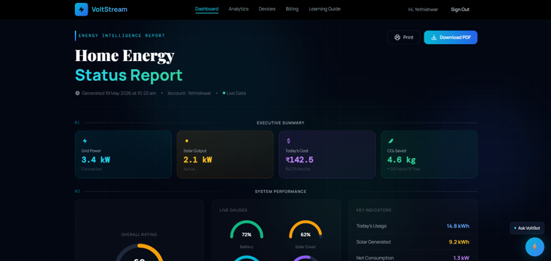
```

---

## 4. Analytics Page

```md
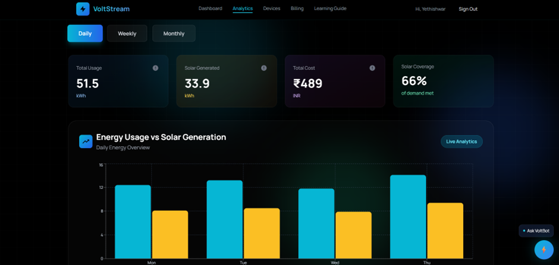
```

---

## 5. Devices Page

```md
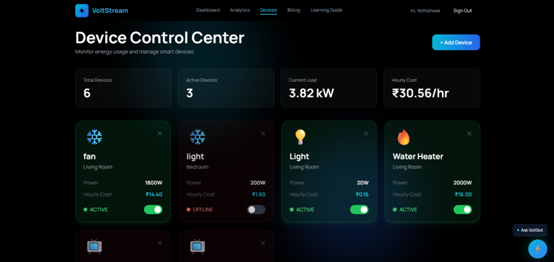
```

---

## 6. Billing Page

```md
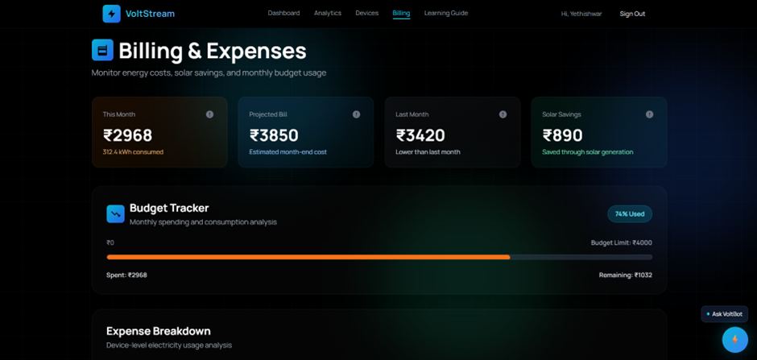
```

---

## 7. Terminologies Page

```md
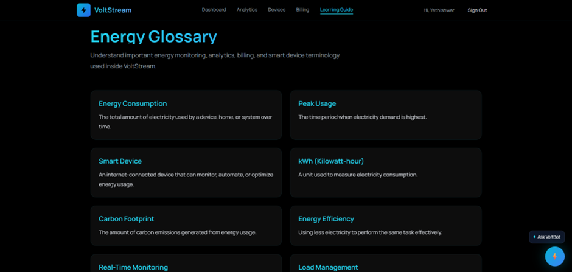
```

---

## 8. General Conversation Bot

```md
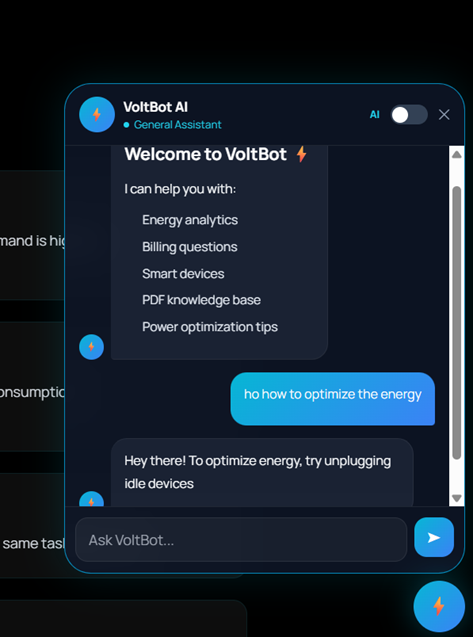
```

---

## 9. RAG Based Bot

```md
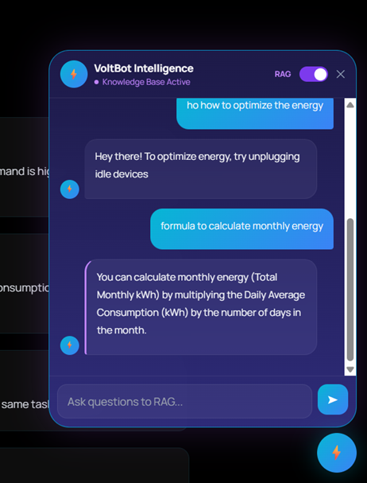
```
---