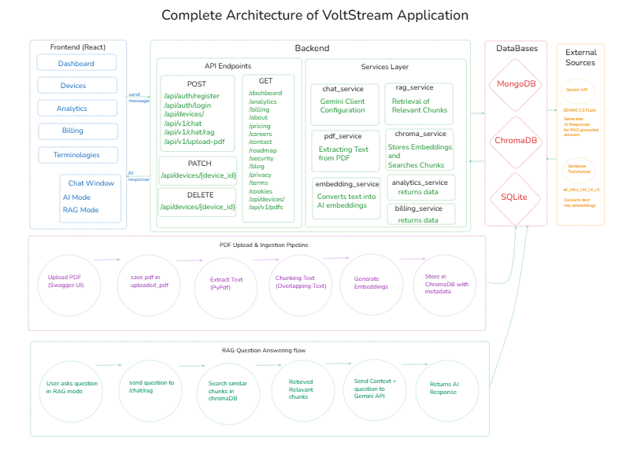
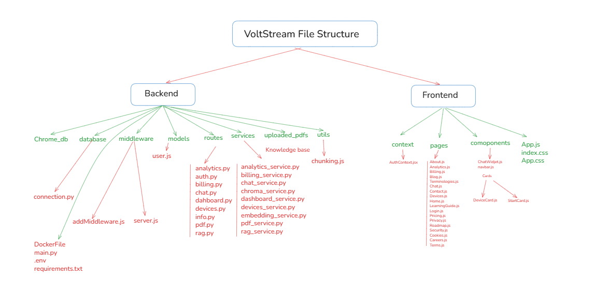

# VoltStream
## Complete End-to-End Architecture

## File Structure

## Overview

VoltStream is an AI-powered smart energy management platform designed to help users monitor electricity consumption, analyze energy usage patterns, and optimize power efficiency through intelligent insights. The platform combines a modern React frontend with a FastAPI backend and integrates conversational AI along with Retrieval-Augmented Generation (RAG) capabilities.

The application provides users with real-time energy analytics, billing insights, smart device management, and an AI-powered assistant called VoltBot. VoltBot can answer general energy-related questions as well as provide context-aware responses using uploaded PDF documents.

---

# Key Features

* AI-powered conversational assistant (VoltBot)
* Retrieval-Augmented Generation (RAG) based chatbot
* Smart energy analytics dashboard
* Electricity billing insights and monitoring
* Device management system
* JWT-based authentication and protected routes
* PDF ingestion and semantic search pipeline
* Responsive and modern UI using Tailwind CSS
* Cloud-ready modular architecture

---

# Frontend Architecture

The frontend of VoltStream is developed using React.js and Tailwind CSS. The frontend is responsible for rendering the user interface, handling page navigation, managing authentication state, and interacting with backend APIs.

The application uses React Router for routing between pages such as Dashboard, Analytics, Billing, Devices, and Chat functionalities. The frontend also contains the VoltBot chat widget, which allows users to interact with the conversational AI assistant.

Authentication state is managed using React Context API, enabling protected routes and session management throughout the application.

---

# Backend Architecture

The backend is developed using FastAPI and follows a modular architecture consisting of routes, services, utilities, and database layers.

The backend handles:

* API endpoint management
* Authentication and authorization
* AI response generation
* Device management
* Billing and analytics services
* PDF processing and RAG workflows
* Database communication

FastAPI routers are used to organize APIs into separate modules such as authentication, chatbot, RAG, analytics, devices, billing, and dashboard services.

---

# Conversational AI System

VoltStream includes a conversational AI assistant called VoltBot. The conversational system uses Google Gemini API to generate intelligent responses related to:

* Energy optimization
* Power consumption
* Electricity billing
* Smart monitoring
* Renewable energy usage
* General knowledge queries

The conversational workflow follows this process:

1. User sends a message through the chatbot interface.
2. Frontend sends the request to FastAPI backend.
3. Backend route validates the request.
4. Chat service forwards the prompt to Gemini API.
5. Gemini generates a response.
6. Backend returns the response to the frontend.
7. Chatbot UI displays the generated reply.

The chatbot behavior is controlled using a detailed system prompt that defines the assistant’s personality, tone, response style, and conversational rules.

---

# Retrieval-Augmented Generation (RAG)

VoltStream also implements a Retrieval-Augmented Generation (RAG) system for context-aware question answering.

The RAG system allows the chatbot to answer questions based on uploaded PDF documents instead of relying only on the language model’s general knowledge.

The PDF ingestion pipeline works as follows:

1. PDF documents are uploaded through FastAPI Swagger endpoints.
2. PDF text is extracted using the PyPDF library.
3. Extracted text is divided into overlapping chunks.
4. Sentence Transformer generates embeddings for each chunk.
5. Chunks and embeddings are stored inside ChromaDB.
6. User asks questions in RAG mode.
7. Similar chunks are retrieved using semantic search.
8. Retrieved context is sent to Gemini API.
9. Gemini generates a context-aware response.

This architecture enables the chatbot to provide more accurate and document-grounded answers.

---

# Authentication System

VoltStream implements JWT-based authentication for secure user access.

The authentication system supports:

* User registration
* User login
* Password hashing using bcrypt
* JWT token generation
* Protected frontend routes
* Protected backend APIs

The authentication workflow includes:

1. User registers or logs in.
2. Password is securely hashed and verified.
3. JWT token is generated by the backend.
4. Frontend stores the token using React Context.
5. Protected APIs validate the JWT token before granting access.

This ensures secure access to private dashboards and device management features.

---

# Database and Storage

VoltStream uses multiple storage systems depending on the functionality.

MongoDB is used for:

* User accounts
* Device data
* Authentication-related information

ChromaDB is used as the vector database for:

* Embedding storage
* Semantic search
* Context retrieval

SQLite is internally used by ChromaDB for persistence.

---

# Technologies Used

## Frontend

* React.js
* Tailwind CSS
* JavaScript
* React Router
* React Context API

## Backend

* FastAPI
* Python
* Pydantic
* Uvicorn
* PyMongo
* bcrypt
* JWT Authentication

## Artificial Intelligence

* Google Gemini API
* Gemini 2.5 Flash
* Sentence Transformers
* all-MiniLM-L6-v2 Embedding Model
* Retrieval-Augmented Generation (RAG)

## Databases

* MongoDB
* ChromaDB
* SQLite

## PDF Processing

* PyPDF
* Custom Text Chunking Logic

## Deployment and DevOps

* Docker
* Firebase Hosting
* Google Cloud Run
* GitHub

---

# Project Structure

The project follows a modular full-stack architecture.

Frontend contains:

* Components
* Pages
* Authentication Context
* Routing Logic
* Chat Widget

Backend contains:

* API Routes
* Service Layer
* Database Connections
* PDF Processing Logic
* Embedding Generation
* ChromaDB Integration
* RAG Services
* Authentication Logic

This modular structure improves scalability, maintainability, and readability of the project.

---

# Conclusion

VoltStream combines modern web development, artificial intelligence, vector databases, and cloud-ready architecture to create an intelligent energy management platform. The integration of conversational AI and Retrieval-Augmented Generation enables users to receive both general guidance and context-aware insights from documents.

The project demonstrates practical implementation of:

* Full-stack development
* AI integration
* Semantic search
* Vector databases
* Authentication systems
* RAG architecture
* REST API development
* Cloud deployment workflows

VoltStream serves as a scalable and extensible foundation for future smart energy monitoring and AI-powered assistance systems.
